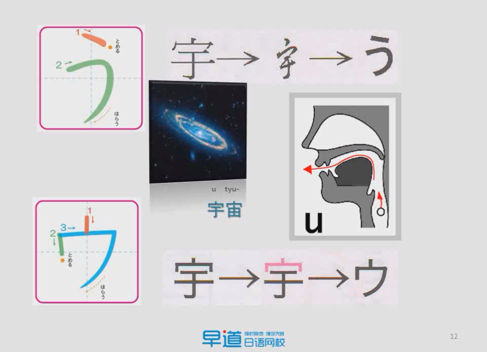

# 发音

## 日语特征

- 孤立语：汉语，越南语：每个字和发音有明显含义，字词之间通过顺序来确定语义
- 黏着语：日语，韩语：通过助词来确定语义

| 语言类别   | 代表性语言     | 特点                                             |
| ---------- | -------------- | ------------------------------------------------ |
| 孤立语     | 汉语 | 每个字和发音有明显含义字词之间通过顺序来确定语义 |
| 黏着语     | <ul><li>日语</li><li>韩语</li><ul> | 通过助词来确定语义顺序不重要                     |
| 屈折语     | 英语 |                                                  |
| 多式综合语 |                |                                                  |

- 振假名：用于给汉字注音的假名
- 送假名：汉字后的假名

## 日语发音

基本的发音规则为：

- 日语读音发音短，不可拖长，拖长则听起来像**双元音**，因此发音要**短促**
- 日语发音口型小，说话强调平缓，口不可张太大
- 日语发音需要放松

### 50音图

#### 元音的发音

- 舌尖贴下牙齿，舌中拱起

-  还是口型不要成圆形

#### 辅音

##### い段和う段的发音

辅音在い段和う段时读音会发生不规则变化。

- す：50音图中，同一段口型不会变，即う、く、す口型和表情应该相同，如果不同，则说明发音错误
- ち：发音类似汉语7的发音，与位置有关
- つ：与位置有关

| 假名 | 位置 | 发音 | 例词                                     |
| ---- | ---- | ---- | ---------------------------------------- |
| ち   | 词头 | qi   | $\stackrel{qi}{千}$$\overset{hi ro}{尋}$ |
|      | 词尾 | ji   |                                          |
| つ   | 词头 | ci   | $\overset{ci ba sa}{翼}$                 |
|      | 词尾 | zi   | $\stackrel{}{}$                          |

##### 前鼻音な行发音方法

前鼻音な行发音方法：

- 舌尖顶住上牙膛，不要弹拨舌头，令其自然放下，可发前鼻音n

- 需要使用舌尖弹动上牙膛

##### TIPS 

- ふ（fu）:使用双唇来控制气流，而不是使用牙齿控制（不要碰到牙齿）

### 发音规律

#### 浊音

##### **じ**和**ぢ** 的区别

| 假名 | 特征                                                         | 例子                                                         |
| ---- | ------------------------------------------------------------ | ------------------------------------------------------------ |
| じ   | - 在单词中出现较多 - 可以出现在**词首**                 | - $\overset{じこ}{事故}$　 - $\overset{じ ぶん}{自分}$  |
| ぢ   | - 由本身读作**chi**的单词与其他词复合后**chi** 发生浊化而来  - 单独的单词出现少，但是复合词中出现多 - 不会出现在**词首** | $\overset{はな}{鼻} + \overset{ち}{血} \Rightarrow \overset{はな}{鼻}\overset{ぢ}{血}$ |

##### **ず**和**づ** 的区别

ず和づ在单词中都有，不像じ和ぢ有明显的区别，只能背单词时记。

| 假名 | 特征                     | 例词                                                   |
| ---- | ------------------------ | ------------------------------------------------------ |
| ず   |                          | - $\overset{しず}{静}か$ - $\overset{すずめ}{雀}$ |
| づ   | - 复合单词中、づ出现的多 | $\overset{つづ}{続}く$                                 |

#### 不送气发音

清音，在不处于第一个发音时，第二个以后，会产生一种**不送气**现象。

- 口型是标准清音的口型，但是口型不要出太多气（吐气少）
- 初学时不建议使用不送气发音

#### 拨音

| 发音         | 后接行                             | 发音                                                         |
| ------------ | ---------------------------------- | ------------------------------------------------------------ |
| 前鼻音**n**  | - た - だ - な - ら | 发前鼻音后接行发音都用到了**舌尖**（弹舌尖）因此发**ん**时发前鼻音，将舌头抬起来，发后面音时直接将**舌头**放下 |
| 闭口**m**    | - ば - ぱ －ま           | 后面的音发音时会用到嘴唇，发m音时嘴巴闭上                    |
| 后鼻音**ng** | q其他场合及**词尾**                | 舌尖未上翘，贴近上牙，口型未闭，**舌根**贴上牙膛             |

#### 拗音

由い段发音加上や、ゆ、よ而来

日语中也用特殊拗音来标注外文中有，日语中没有的发音.

#### 长音

长音的三种表示：

- ア段+あ
- い段+い
- う段+う
- え段+え/い
- お段+お/う

## 语调和声调

### 音调标识法

日语的声调只有**高音** 和**低音** 

#### 横向表示法

- 上面有横线的为高音，其他的为低音

#### 数字表示法

- 第一个假名和第二个假名的高低音相反
- 数字表示法中，数字表示高音在哪个节拍处停止
	- 1：表示高音在第一个音结束，则表示高音只有第一个音节
	- 2：高音在第二个结束，但是12个音节高低音相反，因此高音只有第二个音阶
	- 4：高音一直到第四个音，但是除了1以外，其他高音都是从2个假名开始，因此高音为234音
	- 0：高音一直到最后一个假名，由原则1知，只有第一个音为低音，后面的所有音都是高音

- ともだち：横线一直在，因此为0调,0调时后面的助词也是高音
- いもうと：在最后一个音阶处有降调，因此为4调，后面的助词为低音

### 声调类型

### 语调

语调用来表达感情，否则像机器人说话一样冰冷

- **疑问句**和**强调句**可能在末尾助词升调，升调只有高音和低音，不能再高音基础上再声调，因此要声调，前一个音必须为低音                  
- 其他都是平调或降调        

## TODO

1. 前鼻音后鼻音怎么发 
2. 清音的不送气发音怎么发
3. 音调上，高音和低音怎么发，怎么听出音高

