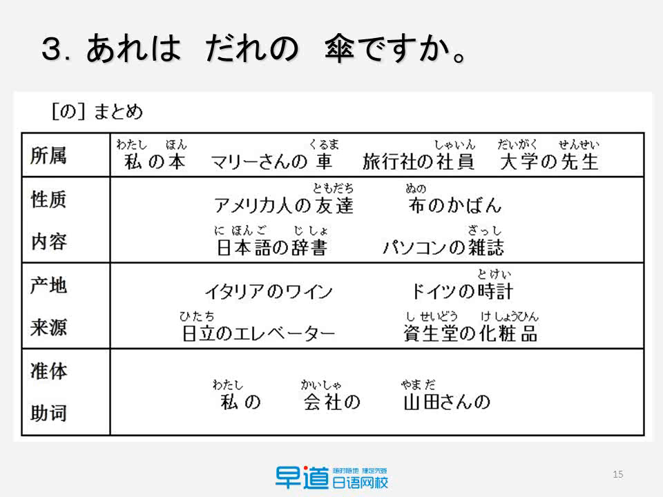
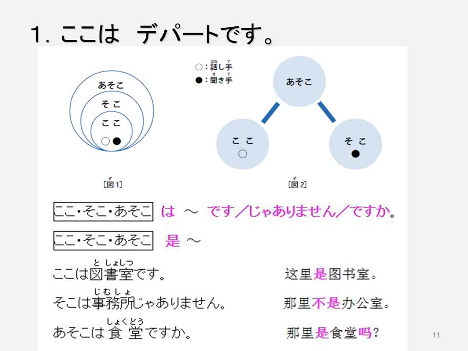
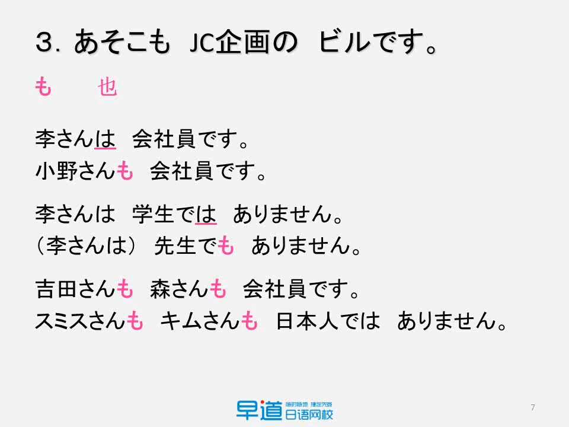

# 课文

主要内容：

|课程 | 主要语法 | 词汇 | 重点|
|-|-|-|-|

## 李さんは　中国人です

### 助词は与存在句

助词**は**用来提示**主题**

#### 存在句的肯定形式

#### 存在句的否定形式

#### 存在句的一般疑问句

特殊疑问句：有特殊疑问词的疑问句，如`where`、`who`，`which`

助词か：

- 疑问句中会有**不送气发音**
- 用助词か构成一般疑问句时，**助词か**为升调

### 助词の表从属

## これは本です

### 词汇

#### 数字的表示法

#### 亲属的叫法

| 词汇       | 用法                                                         | 例句                                                         |
| ---------- | ------------------------------------------------------------ | ------------------------------------------------------------ |
| 自己亲属组 | 只是一个名词，不是用来喊的,只是用来表达辈分                  | 私の**姉**は学生です                                         |
| 别人亲属组 | 喊别人的时候，不论是自己的亲属还是别人的亲属，都是带**さん** 的那一组的词汇 | - 面对自己父亲：**お父さん**、最近お元気ですか？–父亲你最近好吗 - 面对别人父亲：**お父さん**、最近お元気ですか？–你爸爸最近好吗 |

#### こそあど系列词

### 语法

#### 特殊疑问句的构成

#### 助词の的用法

总结：助词の的4种用法

| 用法           | 解释                                       | 例子                                 |
| -------------- | ------------------------------------------ | ------------------------------------ |
| 表示所属关系   | 表示所属、位置、时间等可以翻译成中文的“的” | 大学の先生　本棚の上　明日の朝       |
| 表示性质和内容 | 表示某一个名词是什么做的，关于啥东西的     | 日本語の本                           |
| 表示来源的产地 | 表示一个东西是拿来的，相当于`from`         |                                      |
| 准体助词       | 用于在上下文环境中替代上文中出现过的体言   | - 誰の本ですか - それは私のです |

这里作一个小小的区分：

- 日本の先生：这里表示来源，表示来自日本的老师，强调来源地
- 日本人の先生 ：这里表示性质，表示老师是日本人，强调国籍

## ここは　デパートです

### 词汇

#### 数字组合的音变

1346810，加上其他量词时，容易发生音变。

数字的音变规律：

| 单位 | 音变                                                         |
| ---- | ------------------------------------------------------------ |
| 百   | - 300→さんびゃく - 600→ろっぴゃく - 800→はっぴゃく |
| 千   | - 3000→さんぜん　 - 8000→はっせん                       |

日语同汉语一样，当数量级到万之后，就是いちまん，其他的百十千都不需要加那个1

#### 数词与地点量词的组合音变现象

#### 关于地点的单词辨析

| 单词                                      | 含义                                                         |
| ----------------------------------------- | ------------------------------------------------------------ |
| $\stackrel{よこ}{横}$                     | 纵坐标相同，中间隔了一段空的距离                             |
| $\stackrel{となり}{隣}$                   | 纵坐标相同，但是中间没有空余空间                             |
|                                           |                                                              |
| コンビニ                                  | 一般是连锁的便利店，如711这种                                |
| $\stackrel{ばいてん}{売店}$               | 一般独立的那种小卖部                                         |
|                                           |                                                              |
| $\stackrel{うりば}{売り場}$               | 专柜，柜台，例如超市里面卖烟酒或金银珠宝的地方               |
| バーゲン$\stackrel{かいじょう}{会場}$     | 搞活动，促销卖场和特价区                                     |
|                                           |                                                              |
| ビール                                    | 啤酒                                                         |
| ビル                                      | 大厦                                                         |
| $\stackrel{たてもの}{建物}$               | 建筑物，楼                                                   |
|                                           |                                                              |
| $\stackrel{しょく}{食}\stackrel{ど }{堂}$ | - 学校、公司等场所的食堂 - 或者是商场整层美食中心也叫做食堂（餐馆的集合，多个餐馆才叫食堂） |
| レストラン                                | 独门独户，独立门面的餐厅                                     |
|                                           |                                                              |
| デパート                                  | 商场，商城，如银泰创意城这种                                 |
| デパ地下                                  | 商场的地下层，一般是美食区                                   |
| スーパー                                  | 超市，如沃尔玛这种                                           |

### 句型

#### 关于地点的疑问句

##### 关于地点的代词

こそあど的位置关系：

##### 关于地点的句型的构成

#### 助词も的用法

#### 选择疑问句的用法

## 部屋に机といすがあります

### 单词

#### 表示家庭房间的单词

单词辨析：

| 单词                               | 含义                         |
| ---------------------------------- | ---------------------------- |
| 部屋                               | 房间                         |
| $\stackrel{にわ}庭$                | 院子，yard                   |
| $\stackrel{いえ}家$                | house，强调建筑              |
| $\stackrel{うち}家$                | home，家庭的意思             |
| $\stackrel{か}家\stackrel{ぞく}族$ | 直系亲属，不包括叔叔阿姨这种 |
| $\stackrel{いま}{居間}$            | 居住的地方，卧室             |

#### 方位词辨析

### 语法-存在句的两种形式

#### 存在句的两种基本格式

##### 句型1：使用助词が的存在句

##### 句型2：使用助词は的存在句

##### 两种句型的区别

两种句型的不同点：

| 句型                                                  | 侧重点                                    |
| ----------------------------------------------------- | ----------------------------------------- |
| 【場所】　に 【人/物】　が　【います/あります】       | 重点在于场所，用于表示哪个地方有什么东西  |
| 【人/物】は　【場所】に　【人/物】【います/あります】 | 重点在于人物，用于表示这个人/物的具体位置 |

#### 动词*あります*与*います*

| 动词     | 用法                           | 例句                                                         |
| -------- | ------------------------------ | ------------------------------------------------------------ |
| あります | 主语为没有自主意识的物品时使用 | - **冷蔵庫** に**魚** が**ありません** 冰箱里的鱼是死的，因此是无自由意志之物，故而使用あります |
| います   | 主语为有自主意识的生物时使用   | **あの池**に**魚**が**いません**  池塘里的鱼是活的，有自由意志，故用います |

