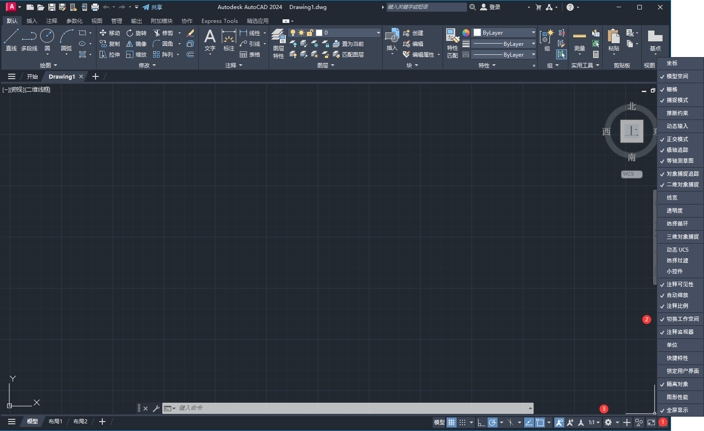
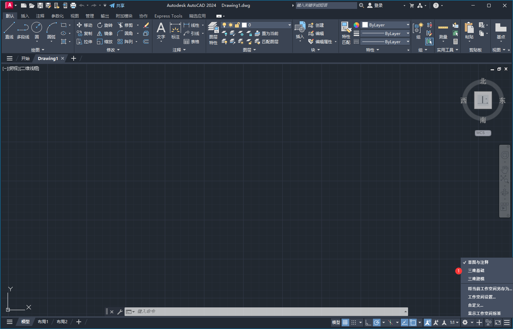
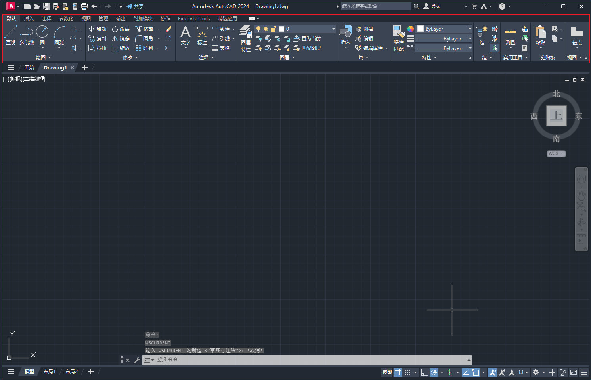
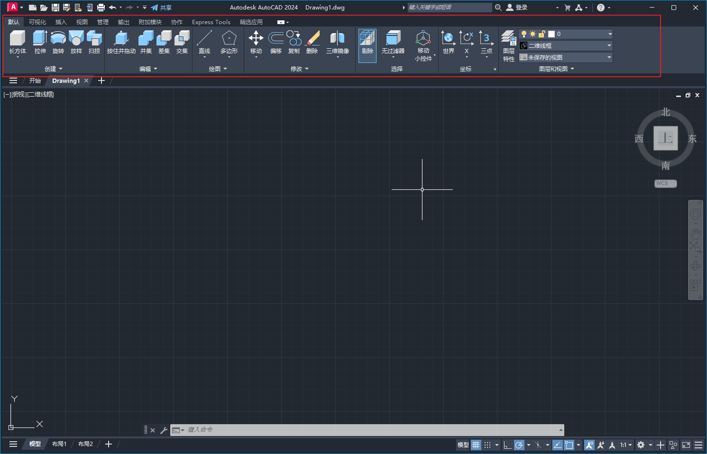
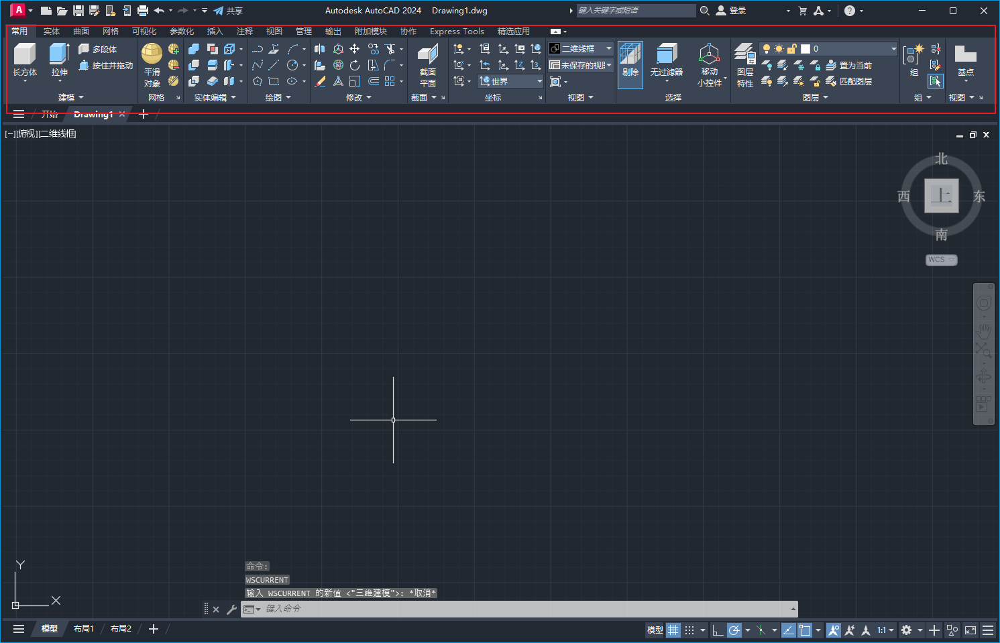
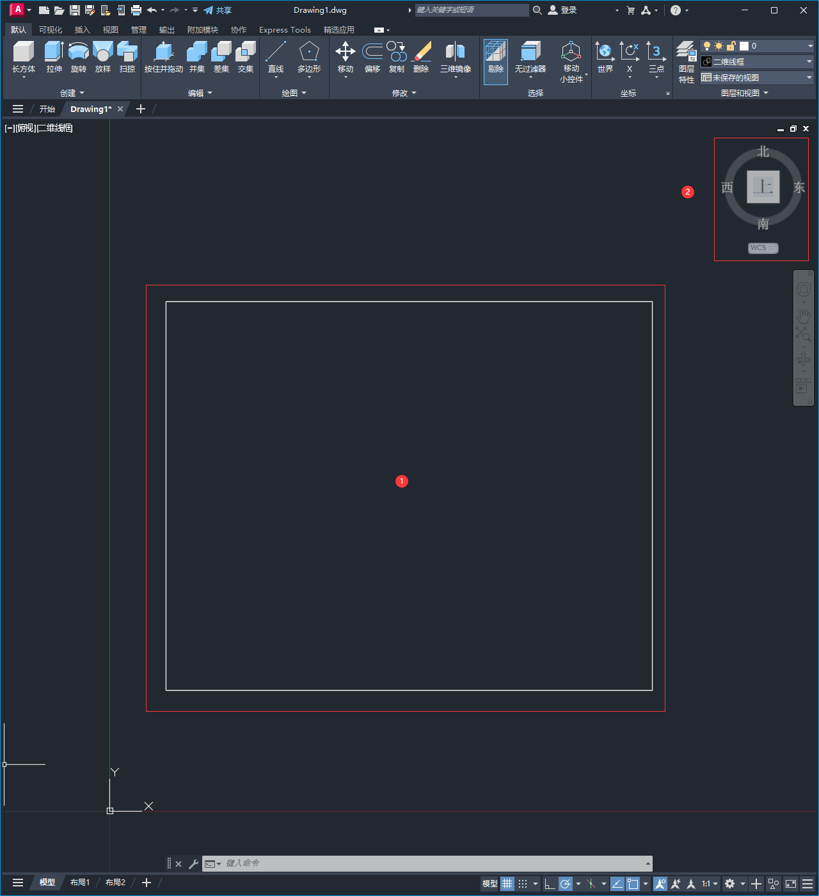
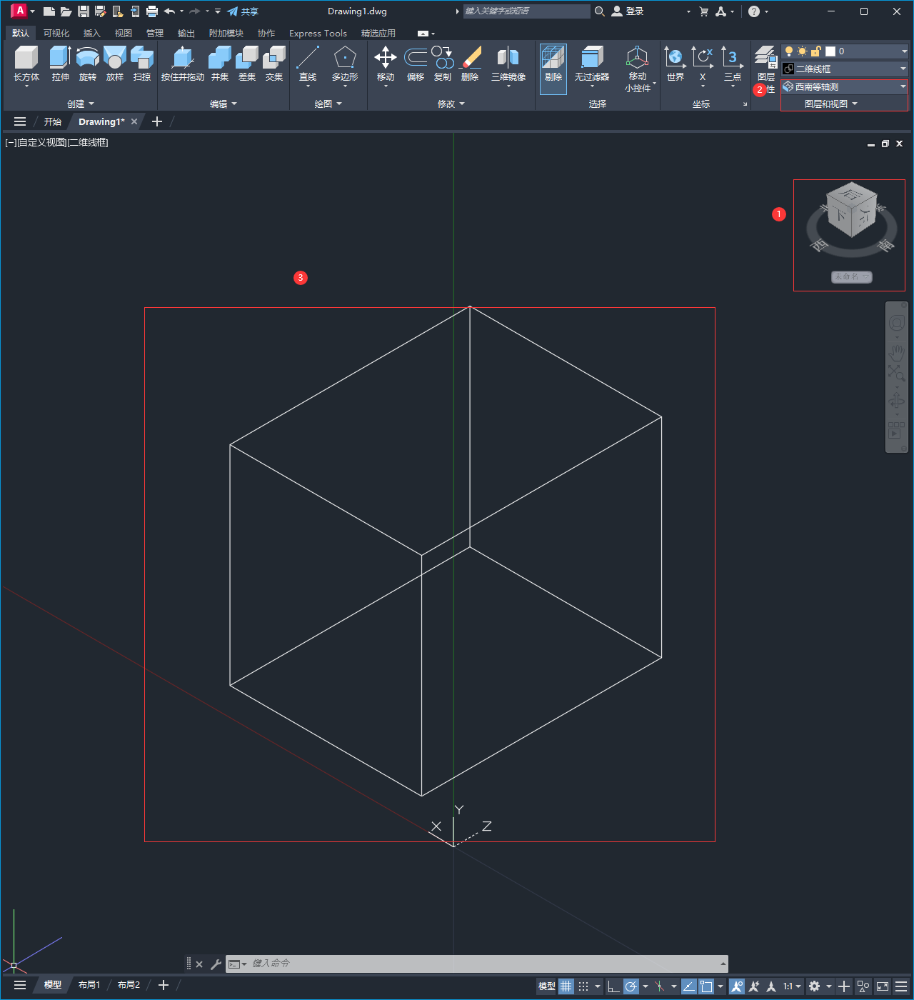

## 切换工作空间

1. 切换工作空间，将2d空间换成3d工作空间
2. 

## 2D绘图与3D绘图界面区别

2d绘图与3d绘图界面的区别：

### 2D绘图界面

### 3D绘图基础界面

### 3D绘图完整界面

## 3D坐标

其中2为3d坐标，几个方向都可以转动，从而将视角切换到对应位置，默认是从上往下的俯视角

更换不同的观察方向，可以获取2d或3d的位置图

## 视图

`shift+alt+鼠标滚轮`：可以旋转视图