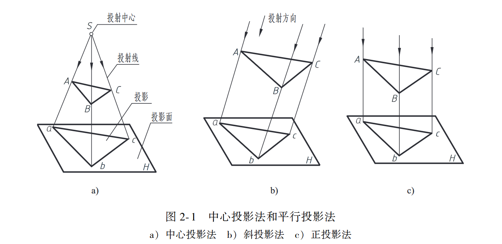
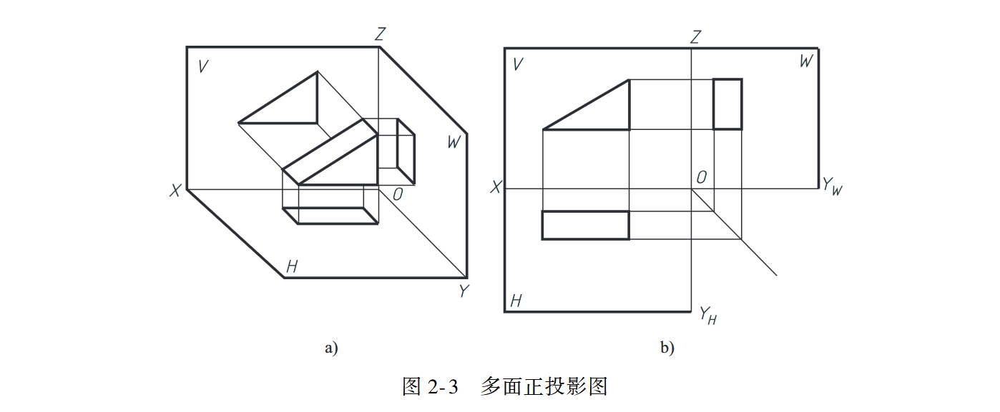
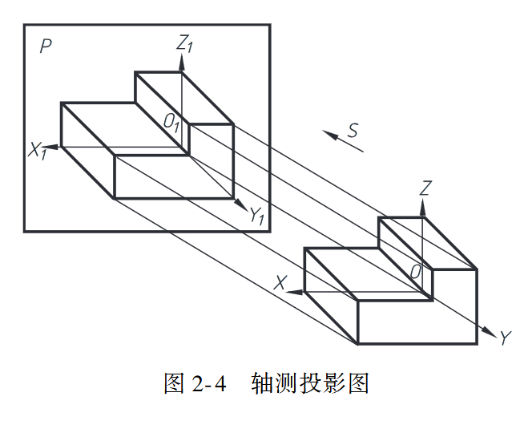
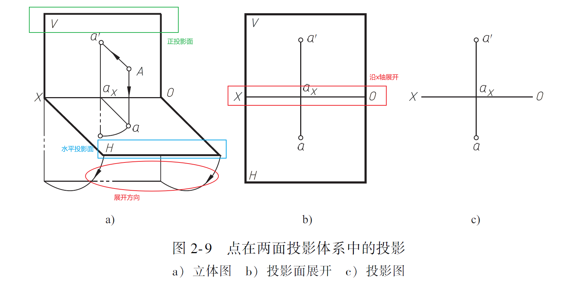
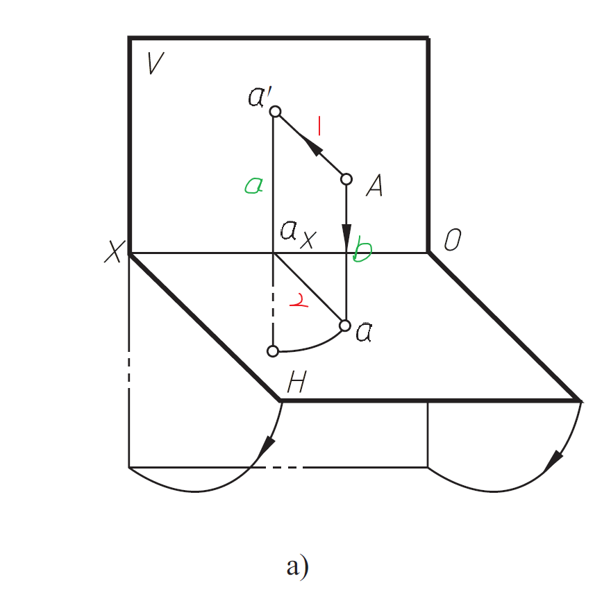
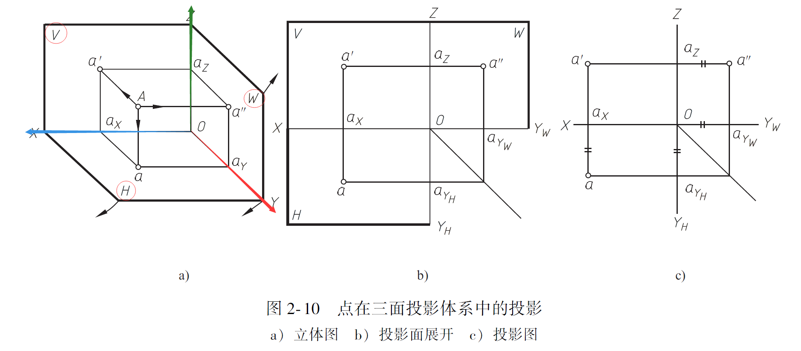
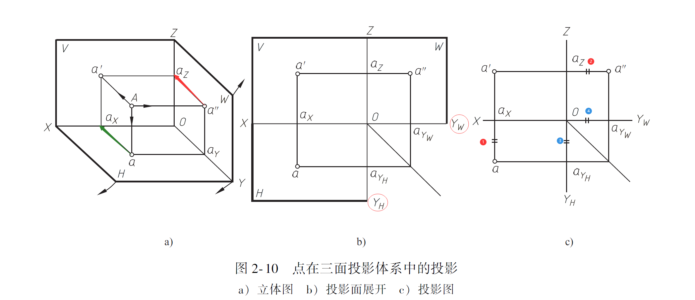

# 点、线、面的投影

## 投影法与投影图介绍

### 三类投影法

机械工程领域常用的投影方法为**正投影**，因此机械领域的**投影==正投影**

### 两种机械领域常用投影图

工程常用的投影图

## 点的投影

### 三面投影体系

#### 两面投影体系

##### 两面投影体系的投影方法

##### 两面投影体系的投影规律

简单来说就是亮点：

- 平面$Aaa'a_x$ 垂直与轴$OX$
- $Aaa'a_x$为一个**矩形** 

#### 三面投影体系

##### 投影方法

在两面投影体系上多加了一个**侧面(W面)**。W面是沿着**y轴** 的投影面。

##### 投影规律

规律总结：

A：(x,y,z)

H面：沿Z轴投影，Z为0，故H投影点坐标为：(x,y,0)

V面：沿y轴投影，y为0，故V投影点坐标为：(x,0,z)

W面：沿x轴投影，x为0，（0，y,z）